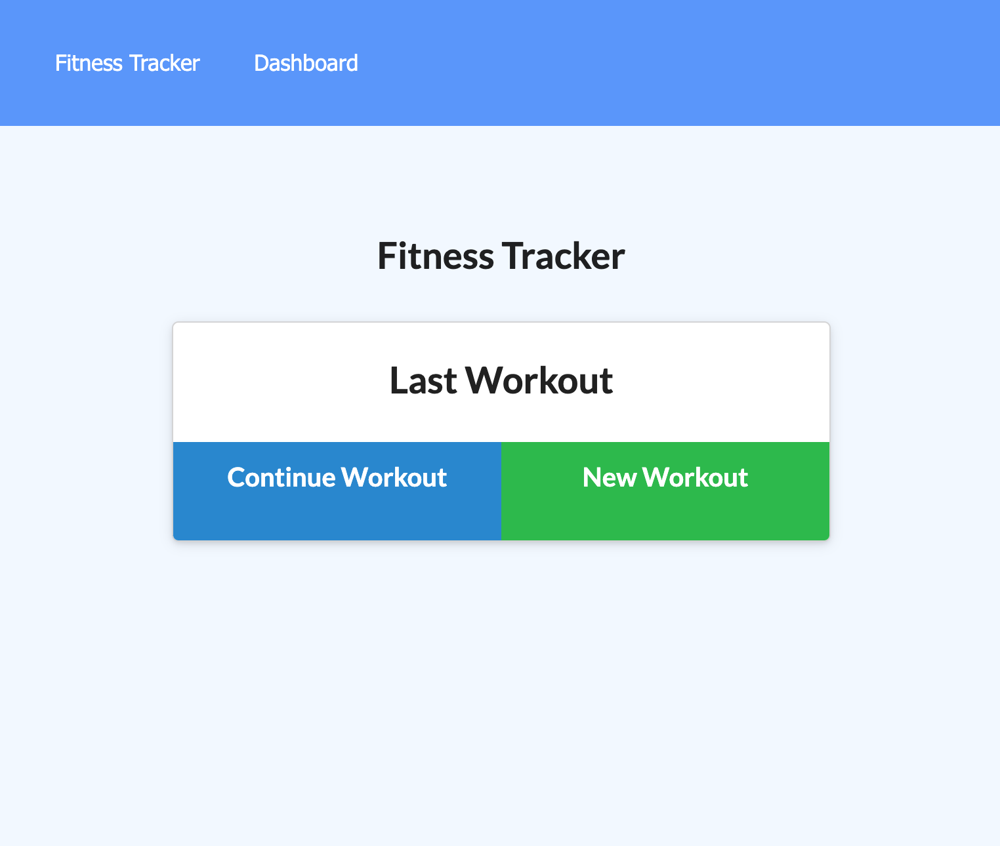

# HW18 Fitness Tracker - Project

## Project Description

This application provides the user a platform to keep track, calculate, and improve on their fitness. More like a note taker but only takes fitness related notes. This project will be developed using Git, MongoDB, NodeJS, NPM Modules, HTML5, Bootstrap.

---

## Table of Content

1. [Project Description](https://github.com/Brondchux/hw18-fitness-tracker#project-description)
2. [Author Info](https://github.com/Brondchux/hw18-fitness-tracker#author-info)
3. [User Story](https://github.com/Brondchux/hw18-fitness-tracker#user-story)
4. [Acceptance Criteria](https://github.com/Brondchux/hw18-fitness-tracker#acceptance-criteria)
5. [Mock-Up Preview](https://github.com/Brondchux/hw18-fitness-tracker#mock-up-preview)
6. [Useful Links](https://github.com/Brondchux/hw18-fitness-tracker#useful-links)
7. [Tech Stack](https://github.com/Brondchux/hw18-fitness-tracker#tech-stack)
8. [Credits](https://github.com/Brondchux/hw18-fitness-tracker#credits)
9. [License](https://github.com/Brondchux/hw18-fitness-tracker#license)

---

## Author Info

Name: Gospel Chukwu

Email: hello@gospelchukwu.com

Portfolio: [www.gospelchukwu.com](https://brondchux.github.io/hw2-my-portfolio/)

---

## User Story

```md
As a user, I want to be able to view create and track daily workouts. I want to be able to log multiple exercises in a workout on a given day. I should also be able to track the name, type, weight, sets, reps, and duration of exercise. If the exercise is a cardio exercise, I should be able to track my distance traveled.
```

---

## Acceptance Criteria

```*
When the user loads the page, they should be given the option to create a new workout or continue with their last workout.

The user should be able to:

- Add exercises to the most recent workout plan.

- Add new exercises to a new workout plan.

- View the combined weight of multiple exercises from the past seven workouts on the `stats` page.

- View the total duration of each workout from the past seven workouts on the `stats` page.
```

---

## Mock-Up Preview

The following animation demonstrates the application functionality:



---

## Useful Links

1. 🗂 [Click me to view github repository for this project](https://github.com/Brondchux/hw18-fitness-tracker/)
2. 🌍 [Click me to view deployed application via heroku](https://live-hw18-fitness-tracker.herokuapp.com/)

---

## Tech Stack


---

## Credits

Appreciations to Ben 🙌🏾 of [Columbia University, Software Engineering Coding Boot Camp](https://bootcamp.cvn.columbia.edu/coding/landing-ftpt/?s=Google-Brand&msg_cv_scta=4&msg_cv_stbn=1&msg_cv_fcta=1&dki=Learn%20Coding&pkw=%2Bcolumbia%20%2Bcoding%20%2Bbootcamp&pcrid=471112563836&pmt=b&utm_source=google&utm_medium=cpc&utm_campaign=GGL%7CCOLUMBIA-UNIVERSITY%7CSEM%7CCODING%7C-%7COFL%7CTIER-1%7CALL%7CBRD%7CBMM%7CCore%7CBootcamp&utm_term=%2Bcolumbia%20%2Bcoding%20%2Bbootcamp&s=google&k=%2Bcolumbia%20%2Bcoding%20%2Bbootcamp&utm_adgroupid=111600049635&utm_locationphysicalms=9067609&utm_matchtype=b&utm_network=g&utm_device=c&utm_content=471112563836&utm_placement=&gclid=CjwKCAjwlrqHBhByEiwAnLmYUA8CIItksRJF6IT6XMX8WOOJBO-jtCRkzXZhI2gvsZrFEpYdRXy54RoC6jQQAvD_BwE&gclsrc=aw.ds) for being our tutor in this bootcamp.

Special thanks to [Google](https://www.google.com) for helping me find the accurate answers to my questions in a very timely manner.

---

## License

[](https://opensource.org/licenses/MIT)
